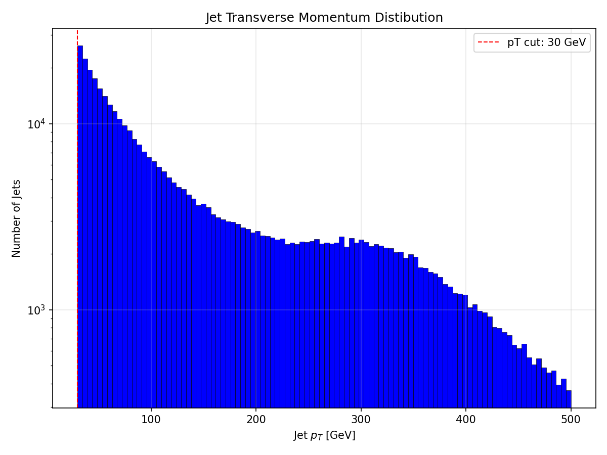
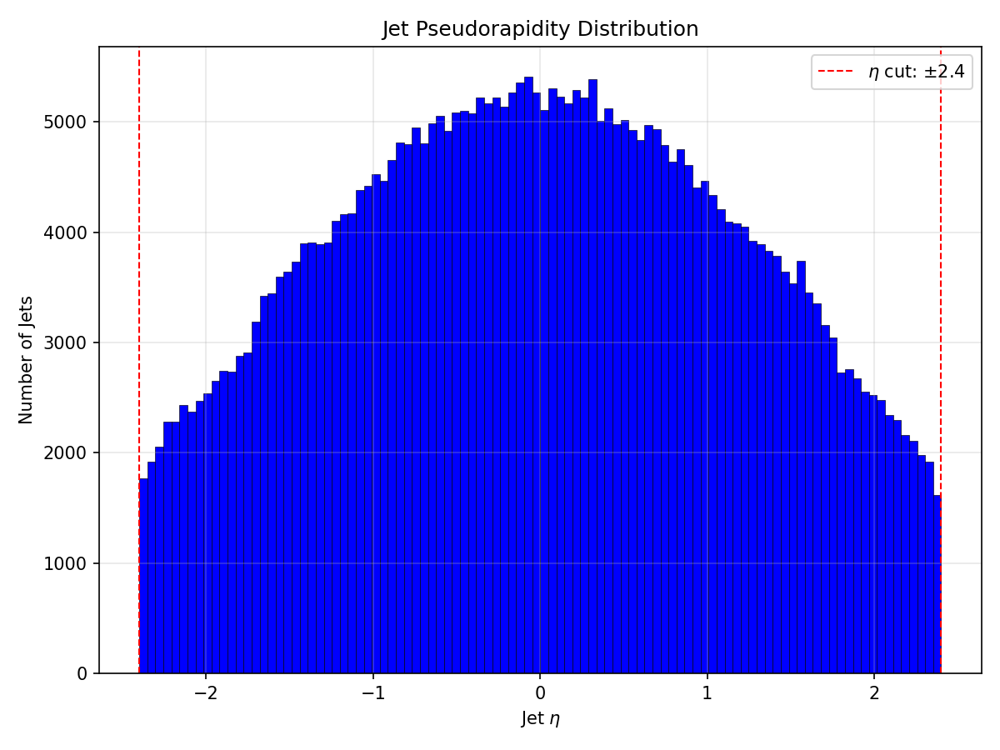
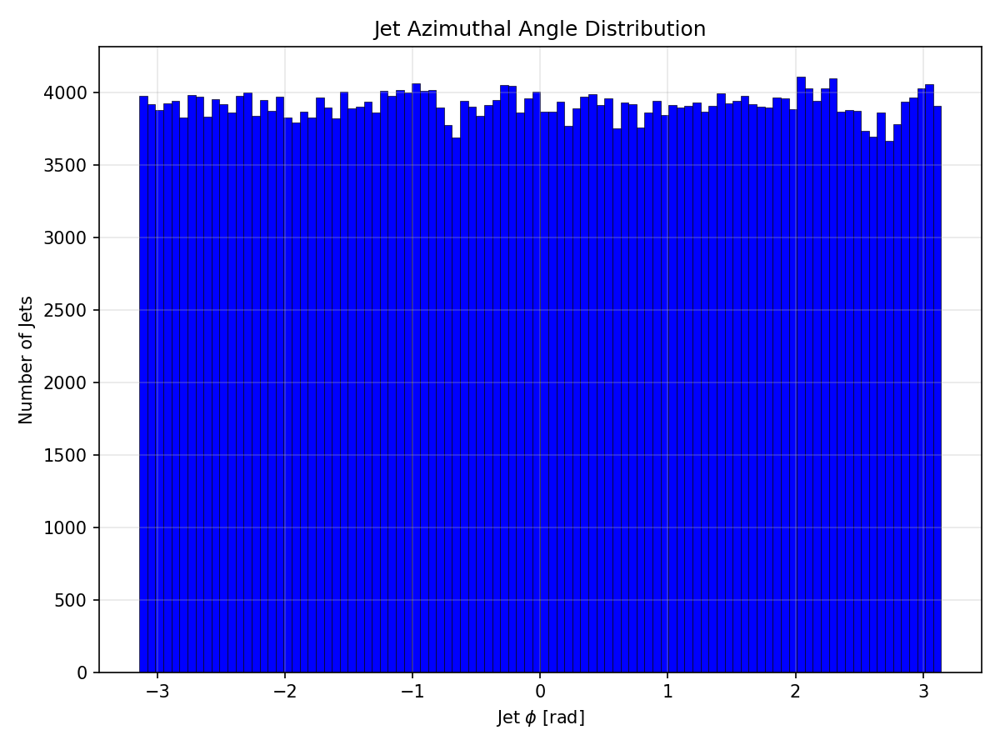
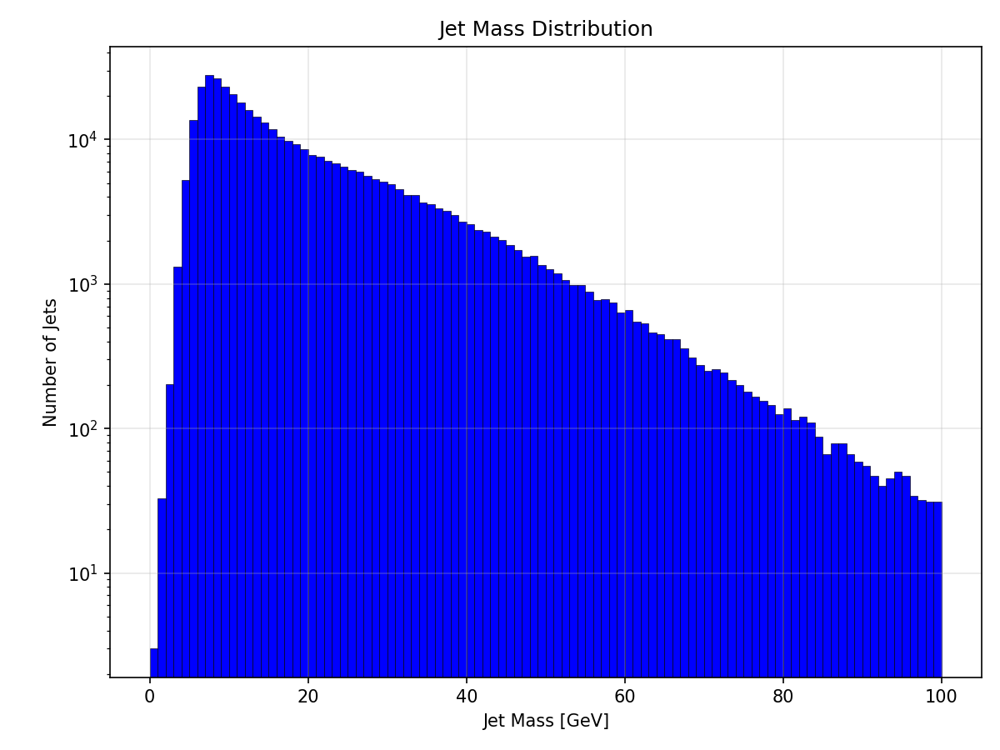
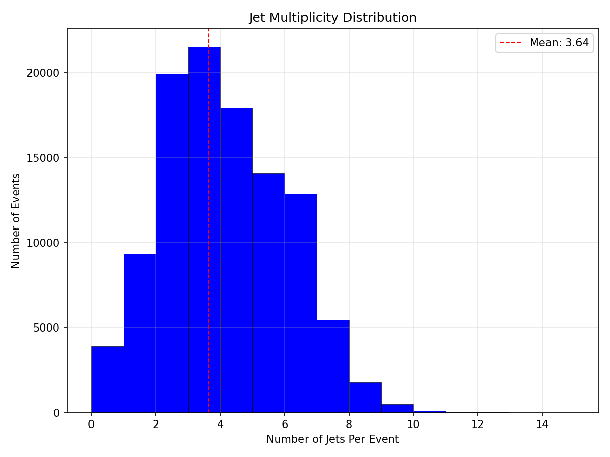

# CMS Jet Analysis

## Overview
This project looks at Jet data from the CMS experiment at the LHC using the 2016 JetHD dataset from the CERN Open Data Portal. When protons collide in the LHD they fragment and the quarks and gluons produced create a spray of hadrons called jets. This analysis looks at the basic kinematic properties of these jets using real collision data.

## Dataset
- **Source:** [CERN Open Data Portal](https://opendata.cern.ch/record/30525)
- **Dataset:** /JetHT/Run2016G-uL2016_MiniAODv2_NanoAODv9-v1/NANOAOD
- **Events analyzed:** 107,505
- **Total jets after cuts:** 391,708

## Selection Cuts
- Jet $p_T$ > 30 GeV
- |Jet $\eta$| < 2.4

## Results

## Requirements
- uproot
- awkward
- numpy
- matplotlib
- scipy

## How to Run
1. Clone the repository
2. Download a NanoAOD file from the [CERN Open Data Portal](https://opendata.cern.ch/record/30525)
3. Put the `.root` folr in the same directory as the notebook
4. Run `analysis.ipynb`

## File Structure
- `simulation.py` - data loading, filtering, and jet multiplicity functions
- `analysis.ipynb` - full analysis notebook with plots
